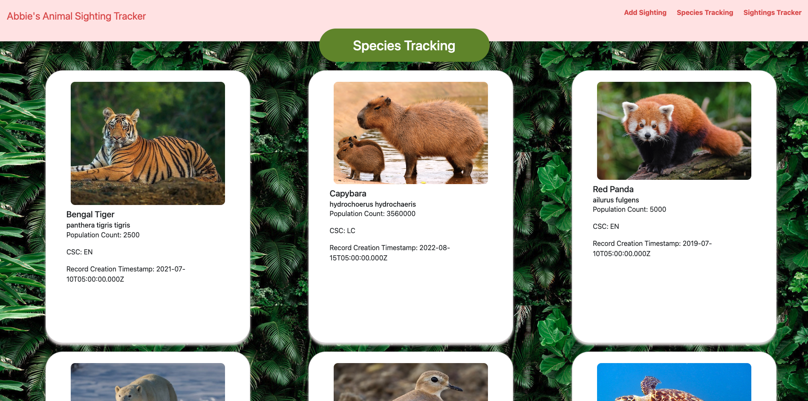
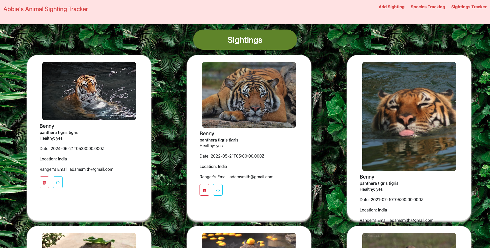
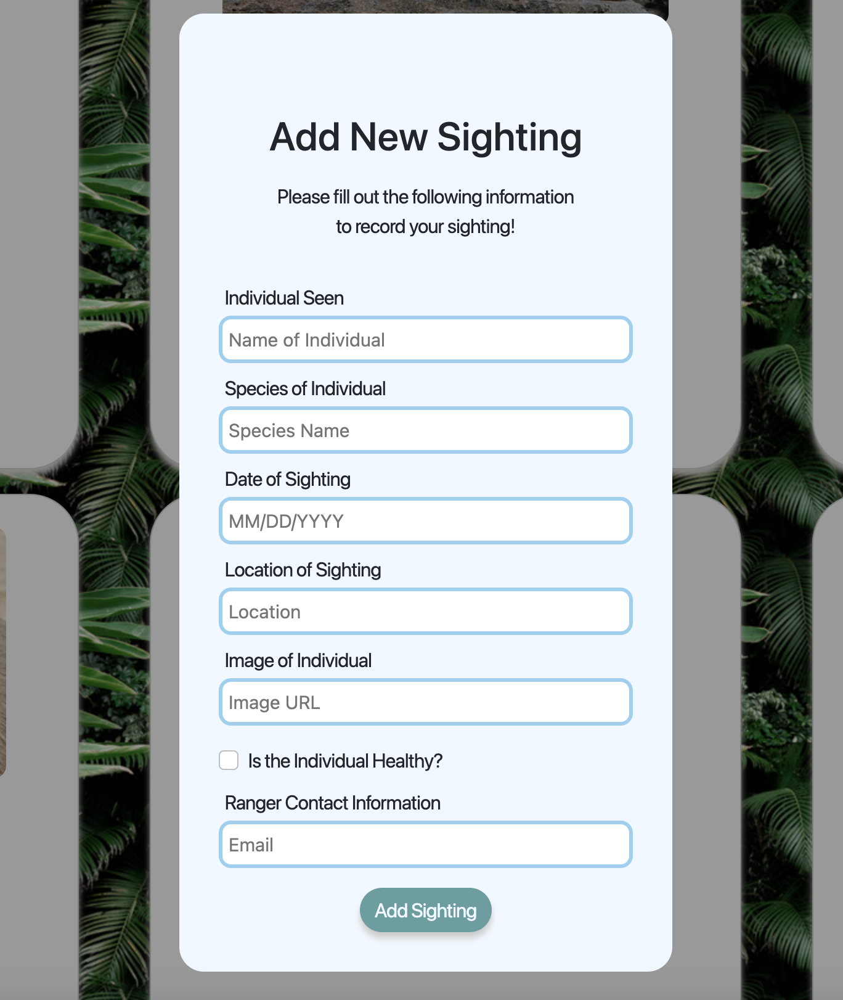

# Project Name: Animal Sighting Tracker

**Description:**
Just spotted the species you've been tracking and need a way to organize each species information? Better yet, need a way to track that specific individual you've been following along? Well look no further! This Animal Sighting Tracker can do just the job! Make tracking your favorite animal a breeze with this full-stack web app.

---

**Table of Contents**

[Introduction](#introduction)
[Installation](#installation)
[Demonstation](#demonstration)
[Features](#features)
[Technologies Used](#technologies-used)
[Acknowledgments](#acknowledgments)
[Contact](#contact)
---

## Introduction: 
**Project: Full-Stack PERN Project**
Weekly Project for Week 10 of the Techtonica Software Engineer in Training Program.

**Project Requirements**
- Show a list of all sightings, including the nickname of the individual sighted at each one (using a JOIN query).
- Form to add a new sighting record
- the other data can be manually added to the DB (just make sure it's in db.sql)
- this also means you only need GET API routes for the other resources
- Include a top-level README.md that says how to run your app locally including all steps after cloning the repo
- Use pg_dump or another method to create a file called db.sql that allows someone else to recreate your DB
    - Use SQL to add some initial data to your database. Add at least 3 animal species, 2 individuals of each species, and at least 5 animal sightings.
- PR must be clean and only include files related to this project
    - Include an appropriate .gitignore (don't commit node_modules!)

## Installation: 
**To create the whole project**
1.  Go to your source directory in your terminal and clone the repository by running the command:

```
$ git clone https://github.com/abbiehuynh/techtonica-projects/animal-sightingtracker.git <NameNewDirectory>
```
2. `npm install` in terminal in server (techtonica-projects/animal-sighting-tracker/server) and client (techtonica-projects/animal-sighting-tracker/client).

3. `npm start` on server side and `npm run dev` on client side to run Eventonica app.

4. Visit `http://localhost:3001` for server site (ExpressJS, NodeJS) and `http://localhost:5173` for client site (React + Vite).


## Demonstration:

Once the page has loaded, you will see the homepage with cards of animals species. This can also be re-accessed through the "Species Tracking" Link. 


Clicking on "Sightings Tracker" will redirect you to page with cards of individual sightings. 


Scroll to the bottom to find the "Add Sighting" button which will redirect you to the form to add a new sighting!



## Features: 
- Interactive links to see the current species being tracked as well as the current individuals being tracked. 
- Form validation and submission of new sightings of individuals. 


## Technologies: 
- ExpressJS, NodeJS
- React + Vite  
- Postman     
- HTML, CSS
- Git
- Fetch
- BootStrap

## Acknowledgments:
Specials thanks to Techtonica Program & Staff, my mentor, and the H2 2024 Cohort. Thank you for your continuous love and support for growth through this tech journey. 

## Contact: 
[Github](https://github.com/abbiehuynh)
Email: abbiehuynhh@gmail.com