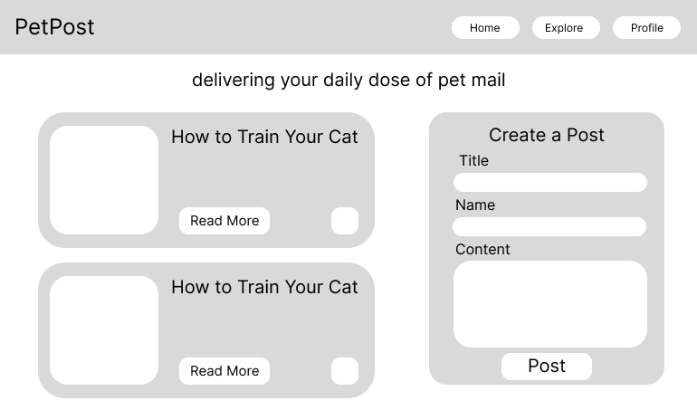
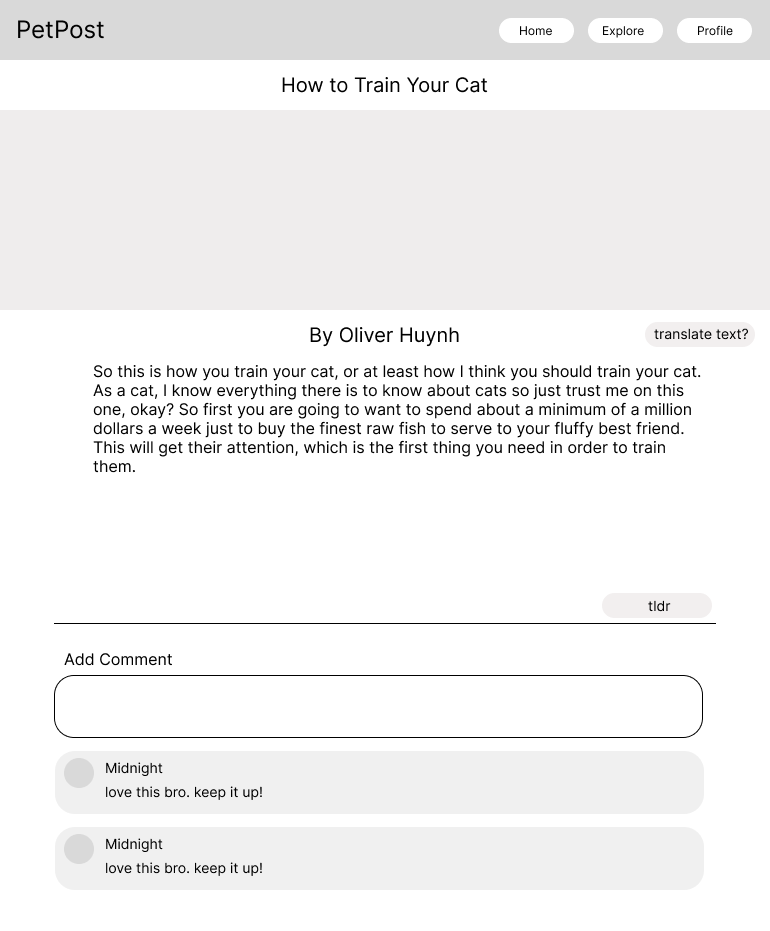
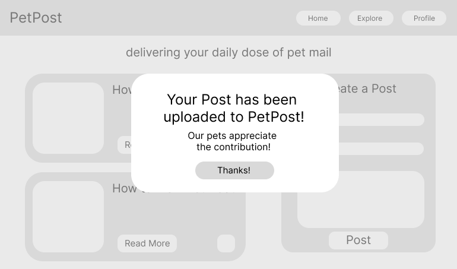

# Project Name: Blog App

**Description:**
Your daily dose of pet mail is here, delivered by the PetPost! Is your beloved pet an aspiring writer or just amazing at everything they do? From warm cuddles, to active play time, let your pet share their next adventure by uploading to the PetPost! Through PetPost, they can see what the latest trends and tips are happening in the Pet World! Download now to stay in the loop!

---

**Table of Contents**

[Introduction](#introduction)
[Installation](#installation)
[Design and Planning](#design-and-planning)
[Demonstation](#demonstration)
[Features](#features)
[Technologies Used](#technologies-used)
[Acknowledgments](#acknowledgments)
[Contact](#contact)
---

## Introduction: 
**Project: Full-Stack PERN Project**
Weekly Project for Week 12 of the Techtonica Software Engineer in Training Program.

**Project Requirements**
- You are going to build a blog about whatever you want! The primary requirement is that you store at least 3 posts in your DB!
- Should be clean and only include files related to this project (You need to ask your mentor to do a full PR as well as one cohort mate)
- Include an appropriate .gitignore (don't commit node_modules!)
- Include a top-level README
- You must use Express, React, and Postgres. You can choose what other technologies and libraries you want to use as well as part of the project.
- You need to use Postgres and Express to connect your DB.
- Your data can’t be hardcoded in the Front-end, it should come from a DB connection
- Feel free to imagine your own schema for this project, but make sure that you have a seed file with at least 3 elements
- React UI
- A list view with all your data
- A form so you can submit a new entry
- Choose a couple of fields that are required and have a couple that aren’t
- A click option to see the individual detail page
- Add at least one test to your components
- Incorporate a single AI feature


## Installation: 
**To create the whole project**
1.  Go to your source directory in your terminal and clone the repository by running the command:

```
$ git clone https://github.com/abbiehuynh/techtonica-projects/blod-app.git <NameNewDirectory>
```
2. `npm install` in terminal in server (techtonica-projects/blog-app/server) and client (techtonica-projects/blog-app/client).

3. `npm start` on server side and `npm run dev` on client side to run Eventonica app.

4. Visit `http://localhost:3001` for server site (ExpressJS, NodeJS) and `http://localhost:5173` for client site (React + Vite).

## Design and Planning:
Wireframes created for main features:
- page that lists all posts and form to add posts

- page that shows more details of individual post with comments section

- page that confirms post has been uploaded


## Demonstration:

Once the page has loaded, you will see the Home page with cards of pet posts. This can also be re-accessed through the "Home" Link. 


To the right of the Home page is a form that will allow you to add a post to the list of posts to the left 


Clicking on "Read More" on each pet post will redirect you to a details page of the pet post. This will include the post with the full written content of the blog, and a comments sections.  


Scroll to the bottom to find the Comments section, where there will be a form to add a comment to this post.


Clicking on the "Profile" Link will redirect you to the User's Profile


## Features: 
- Interactive links to navigate to the Home Page, Explore Page, Profile Page, as well as a details page of the post. 
- Form validation and submission of new post and comments. 


## Technologies: 
- ExpressJS, NodeJS
- React + Vite  
- Postman     
- HTML, CSS
- Git
- Fetch
- BootStrap
- Testing:
    - Jest, Babel 
    - Supertests

## Acknowledgments:
Specials thanks to Techtonica Program & Staff, my mentor, and the H2 2024 Cohort. Thank you for your continuous love and support for growth through this tech journey. 

## Contact: 
- [Github](https://github.com/abbiehuynh)
- Email: abbiehuynhh@gmail.com