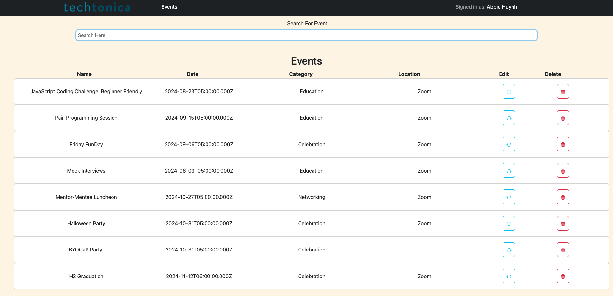
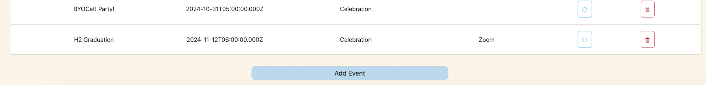
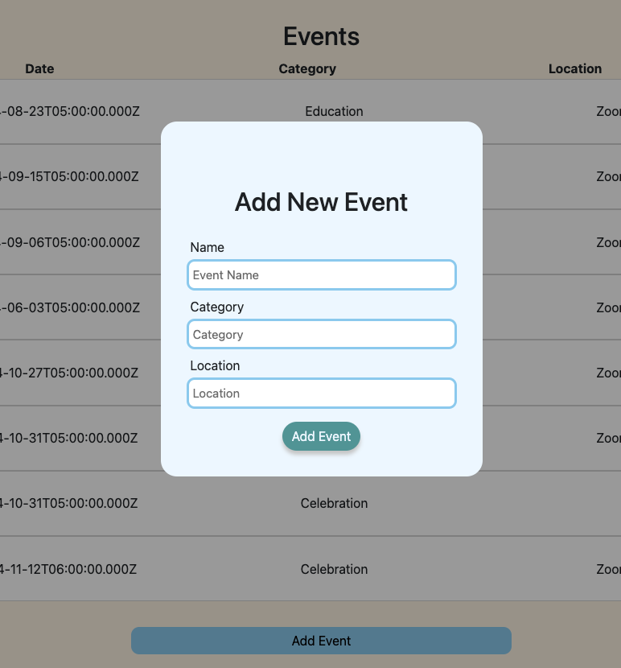
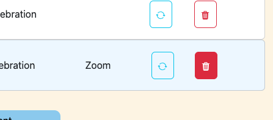

# Project Name: Eventonica

**Description:**
Have some free time and looking for an activity to do? Well, look no further! This Eventonica app includes a database full of events that you can search through depending on what you're feeling up to! Want to improve your coding skills? Search through the Education category to find your next Coding Challenge! Need a break from all that coding? Take a look through the Celebration events and take a moment to share those small wins! The Eventonica app is sure to fill your free time with what you've been looking for!

---

**Table of Contents**

[Introduction](#introduction)
[Installation](#installation)
[Usage](#usage)
[Demonstation](#demonstration)
[Features](#features)
[Technologies Used](#technologies-used)
[Acknowledgments](#acknowledgments)
[Contact](#contact)
---

## Introduction: 
**Project: Creating a full-stack web app with React and a database to manage events**
Weekly Project for Week 9 of the Techtonica Software Engineer in Training Program.

**Primary Learning Goals:**
1. For the first time connect to a DB and pass that data all the way up to React
2. Getting comfortable creating Express routes for CRUD operations
3. Learn about and use the UseReducer hook
4. By the end of the project, show comfort when:
    - implementing the useState hook
    - creating forms in React
    - parsing and displaying data from a DB in React
5. Stretch goal: Implement favoriting and unfavoriting events (PUT request)


**Project Requirements**
1. Use the Techtonica Template created with Vite as the foundation of your project
2. Implement GET, POST, and DELETE requests (PUT for editing is a stretch goal, not required)
3. At least 15 commits and 1 PR (every time you make a working change to the code, commit + push at least daily)
4. Obviously customize the look of your page with CSS techniques
5. Implement some basic tests
6. Create a README
7. Implement the useReducer hook


## Installation: 
**To create the whole project**
1.  Go to your source directory in your terminal and clone the repository by running the command:

```
$ git clone https://github.com/abbiehuynh/techtonica-projects/eventonica.git <NameNewDirectory>
```
2. `npm install` in terminal in server (techtonica-projects/eventonica/server) and client (techtonica-projects/eventonica/client).

3. `npm start` on server side and `npm run dev` on client side to run Eventonica app.

4. Visit `http://localhost:5050` for server site (ExpressJS, NodeJS) and `http://localhost:5173` for client site (React + Vite).

## Usage: 
- Allows users add new events through a form, and to search and remove exisiting events.
- Provides a method to keep track and organize exisitng events. 

## Demonstration:

Once the page has loaded, you will see a search bar with a table of listed events below. 


If you scroll to the bottom of the list, you will find an "Add Event" Button that will load a pop-up form for creating a new event. 


The pop-up form will appear as shown below. 


Once the information is filled out, click "Add Event" to add an event to the table. 

If the event is canceled, users also have the option of deleting existing events in the table by clicking the trash icon to the right of every event. 


## Features: 
- Allows users to create and add new events.
- Allows users to remove or delete existing events. 


## Technologies: 
- ExpressJS, NodeJS
- React + Vite  
- Postman     
- HTML, CSS
- Git
- Fetch

## Acknowledgments:
Specials thanks to Techtonica Program & Staff, my mentor, and the H2 2024 Cohort. Thank you for your continuous love and support for growth through this tech journey. 

## Contact: 
- [Github](https://github.com/abbiehuynh)
- Email: abbiehuynhh@gmail.com

