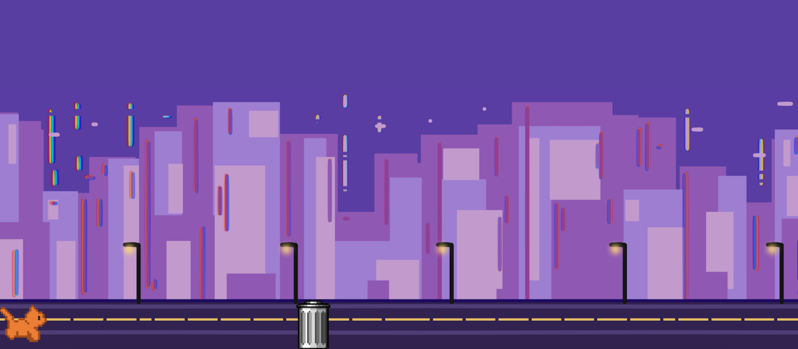
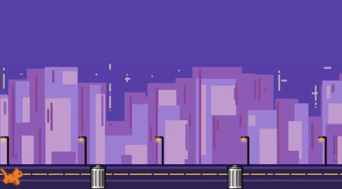
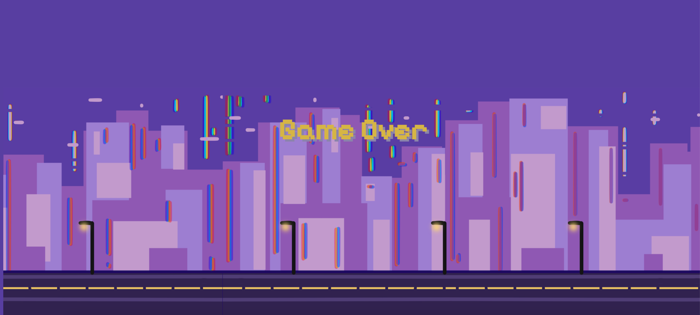

# Project Name: Cat Escape

**Description:**
An everyday city cat making his way through the city night. He must jump past obstacles and quickly scurry past any challenges he may face. Help him survive just one more night in this big, scary city!

---

**Table of Contents**

[Introduction](#introduction)
[Installation](#installation)
[Usage](#usage)
[Demonstation](#demonstration)
[Features](#features)
[Technologies Used](#technologies-used)
[Acknowledgments](#acknowledgments)
[Contact](#contact)
---

## Introduction: 
**Project: JS & HTML Games:**
Weekly Project for Week 4 of the Techtonica Software Engineer in Training Program

**Project Requirements**
- Make 1 or more games using JS and HTML
- Use DOM methods to connect HTML and JS to create a game
- Include a README with a demo, and instructions for how to run the code
    - Pro-tip: CSS is not a requirement of this project, so it's smart to do the basics and focus on other curriculum unless you have extra time to practice design

## Installation: 
**To create the whole project**
1.  Go to your source directory in your terminal and clone the repository by running the command:

```
$ git clone https://github.com/abbiehuynh/techtonica-projects.git NameNewDirectory
```
2. Open using the live server extenstion to play the game (if using VSCode).

## Usage: 
- Click space bar to "jump" over obstacles in game. 
- Refresh to restart game.

## Demonstration:

Once the page has loaded, you will see your virtual pet appear on the bottom left side of the screen. 


As obstacles appear (such as the trashcan), press the space bar to jump over obstacles. 


If your virtual pet hits an obstacle, this screen will appear, announcing "Game Over". 



## Features: 
- Interactive user experience through keyboard keys
    - jump function - space bar
- Randomized spawn of obstacles
    - generateObstacles function


## Technologies: 
- JS       
- HTML
- CSS
- Git

## Acknowledgments:
Specials thanks to Techtonica Program & Staff and the H2 2024 Cohort. Thank you for your continuous love and support for growth through this tech journey. 

## Contact: 
[Github](https://github.com/abbiehuynh)

[LinkedIn](https://www.linkedin.com/in/abbie-huynh/)

email: abbiehuynhh@gmail.com

[Project Link: Cat Escape](https://github.com/abbiehuynh/techtonica-projects/tree/js-html-games/js-html-games)
