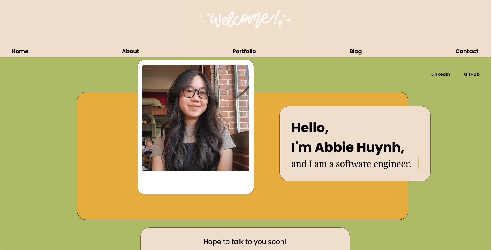
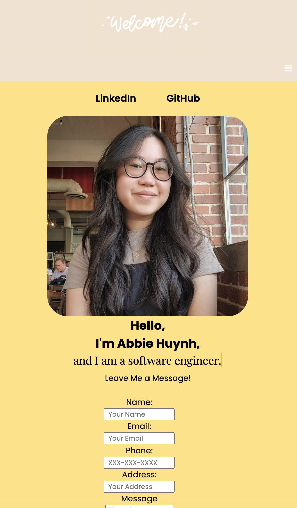
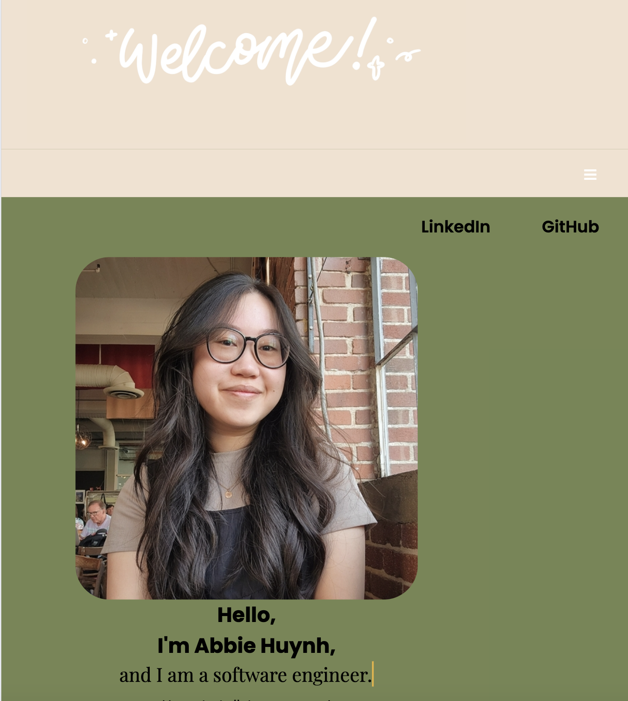
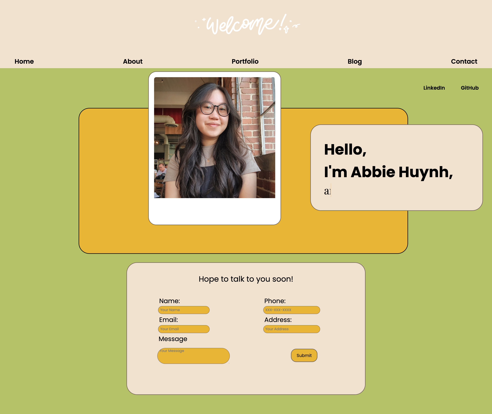

# Project Name: Portfolio Webpage

**Description:**
Hi, my name is Abbie Huynh, and I am a software engineer!
Welcome to my portfolio webpage, where you can get all the ways to contact me and keep up with the latest updates! 

---

**Table of Contents**

[Introduction](#introduction)
[Installation](#installation)
[Portfolio Webpage](#portfolio-webpage)
[Features](#features)
[Technologies](#technologies)
[Acknowledgments](#acknowledgments)
[Contact](#contact)
---

## Introduction: 

**Project: Portfolio Webpage:**

Weekly Project for Week 3 of the Techtonica Software Engineer in Training Program

**Project Goals:**

To demonstrate understanding of the foundational topics covered in the first two weeks of Techtonica before diving further into the PERN stack.
    1. Create a new HTML/CSS webpage
    2. Modify the contents of your page using DOM methods
    3. Use common CSS rules to align content (left, right, center), modify colors, sizes of containers and text, etc.
    4. Get comfortable using CSS media queries

## Installation: 
**To create the whole project**
1.  Go to your source directory in your terminal and clone the repository by running the command:

```
$ git clone https://github.com/abbiehuynh/techtonica-projects.git NameNewDirectory
```
2. `cd portfolio-website` in the Command Line to find this project.

3. Open the index.html using the Live Server extenstion if using VSCode!

## Portfolio Webpage:
Home page


Implemented media queries for the following:
Small, Medium, and Large Screens
<br />




## Features: 
- Interactive links to social media such as LinkedIn and Gihub, as well as a Portfolio Page!
- Text animation of title, "I am a software engineer"
- Semantic tags to improve SEO and accessibility
- HTML Form with required and not required inputs, as well as validation
- Media queries for narrow, medium, and wide browser views

- Future implementation:
    - adding an about, blog, and contact page 

## Technologies: 
- JS, HTML, CSS
- CSS Grids, Flexbox
- Git

## Acknowledgments:
Specials thanks to Techtonica Program & Staff, my mentor, and the H2 2024 Cohort. Thank you for your continuous love and support for growth through this tech journey. 

## Contact: 
[Github](https://github.com/abbiehuynh)

[LinkedIn](https://www.linkedin.com/in/abbie-huynh/)

email: abbiehuynhh@gmail.com
