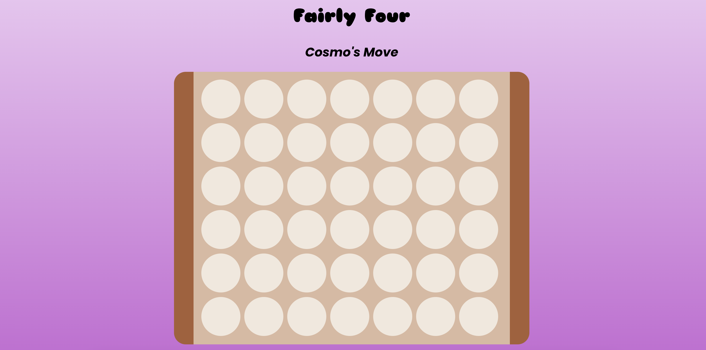
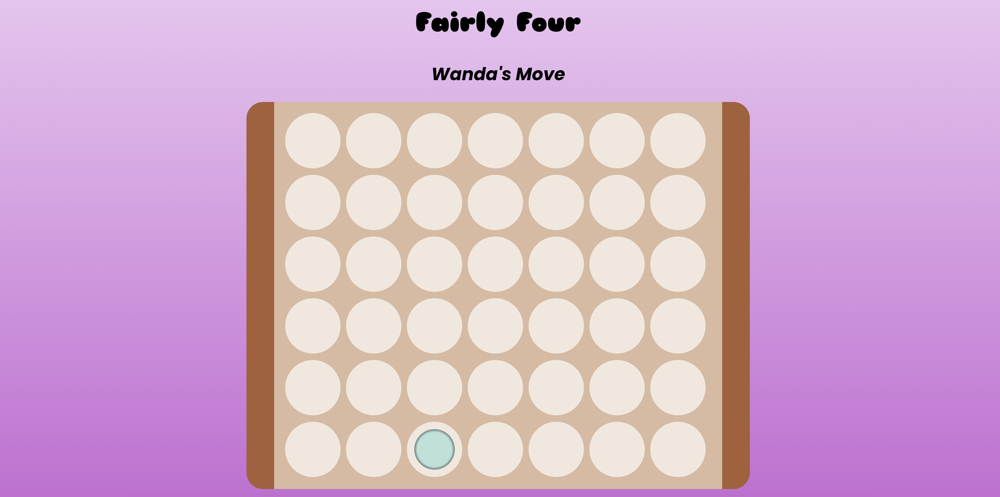
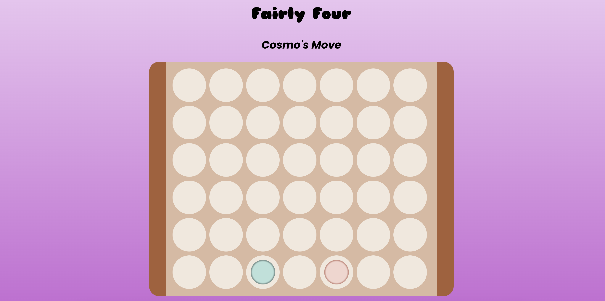
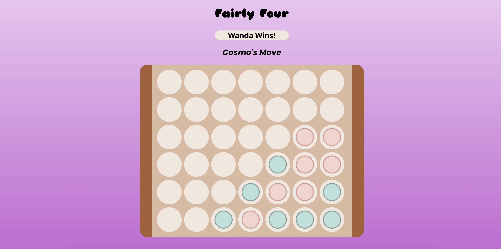

# Project Name: Fairly Four

**Description:**
Have you ever had Fairly Even Parents? Well, now you can with this spin of Connect Four, or *cought cough* Fairly Four! Connect four slots, *fair and square,* and you'll be sure to summon your very own Fairly Even Parents!

---

**Table of Contents**

[Introduction](#introduction)
[Installation](#installation)
[Usage](#usage)
[Demonstation](#demonstration)
[Features](#features)
[Technologies Used](#technologies-used)
[Acknowledgments](#acknowledgments)
[Contact](#contact)
---

## Introduction: 
**Project: JS & HTML Games:**
Weekly Project for Week 5 of the Techtonica Software Engineer in Training Program

**Project Requirements**
- Write a game in React
- Practice components, props, and state
    - Have some sort of input that you receive from one component that you pass to another (such as number of tries, hi/low number, etc.)
    - Have some sort of counter that uses the useState hook to update the score or count to the screen
- Commit code at least 15 times
- Submit at least 1 PR by the end of the week

## Installation: 
**To create the whole project**
1.  Go to your source directory in your terminal and clone the repository by running the command:

```
$ git clone https://github.com/abbiehuynh/techtonica-projects/react-game-connectfour.git NameNewDirectory
```
2. `npm install` in terminal in client (techtonica-projects/contact-list-app/client).

3. `npm run dev` on client side to run Connect Four app.

4. Visit `http://localhost:5173` to view app.

## Usage: 
- Click circle or "slot" to insert token.
- Alternate turns with opposing player.  
- Update 2.0
    - Click "Play Another Game" button to play again
    - Click "Reset Score" button to reset the score tracker

## Demonstration:

Once the page has loaded, you will see a Connect Four game board in the middle of the screen.


If you click on the slot you would like to insert your token, a token will appear at the bottom most row of that column.  


If you click on another slot, the next token inserted will be the token of the opposing player. 


Continue taking turns to continue the game until someone "Connects Four!" The game will anounce the winner!


App 2.0 Update


## Features: 
- Interactive user experience through mouse click
    - click slot to insert token to bottom most available slot
- Update 2.0
    - Adds "Play Another Game" Button to allow players to play mulitple rounds
    - Adds Score Counter to keep track of player wins
    - Adds "Reset Score" Button to reset current score

## Technologies: 
- React + Vite
- JS       
- HTML
- CSS, Flexbox
- Git

## Acknowledgments:
Specials thanks to Techtonica Program & Staff, my mentor, and the H2 2024 Cohort. Thank you for your continuous love and support for growth through this tech journey. 

## Contact: 
[Github](https://github.com/abbiehuynh)

[LinkedIn](https://www.linkedin.com/in/abbie-huynh/)

email: abbiehuynhh@gmail.com

[Project Link: Fairly Four](https://github.com/abbiehuynh/techtonica-projects/tree/react-game/react-game-connectfour)
