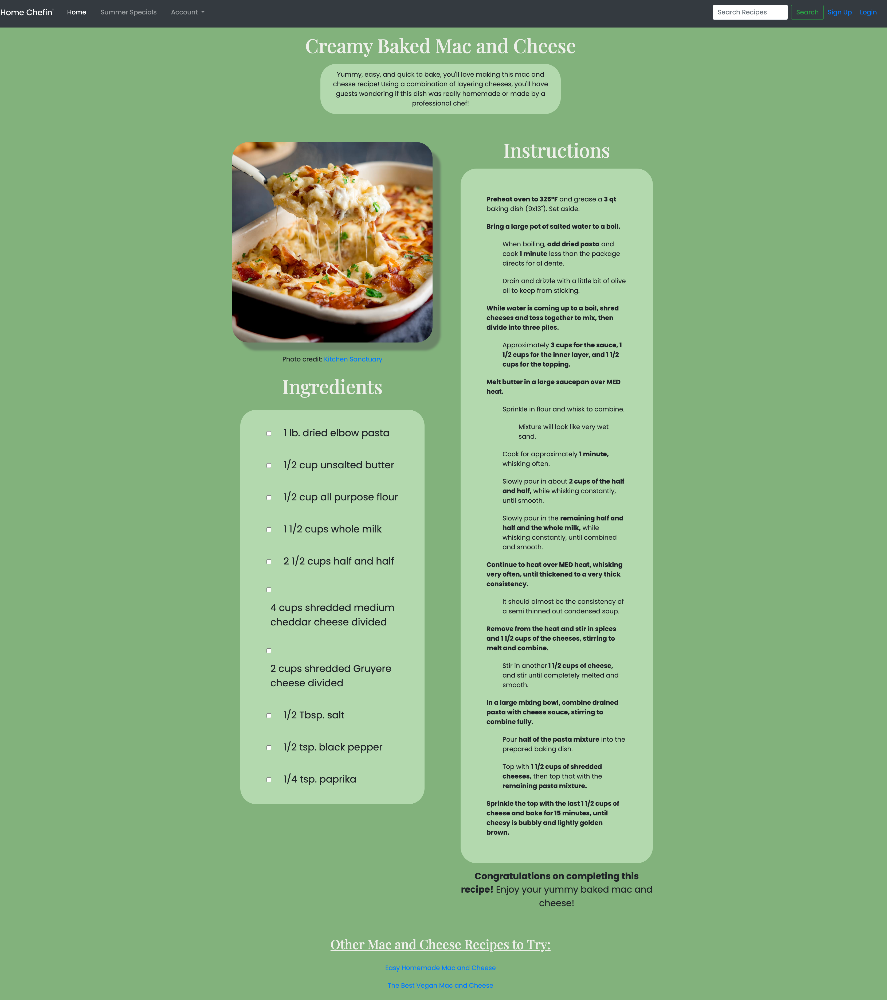

# Project Name: Recipe Page

**Description:**
Checkout my recipe page showcasing "Creamy Baked Mac and Cheese." A recipe perfect for any special occasion! 

---

**Table of Contents**

[Introduction](#introduction)
[Installation](#installation)
[Portfolio Webpage](#portfolio-webpage)
[Features](#features)
[Technologies](#technologies)
[Acknowledgments](#acknowledgments)
[Contact](#contact)
---

## Introduction: 

**Project: Portfolio Webpage:**

Weekly Project for Week 1 of the Techtonica Software Engineer in Training Program

**Project Goals:**
1. Learning to use main HTML elements such as 
```
<h1></h1>, <div></div>, <ul></ul>, <ol></ol>, <li></li> <p></p>, , etc.
```
2. Basic CSS, like rules for divs and IDs or implementing CSS elements like background color
3. Understanding working with different containers
4. Using GitHub to commit and push code, plus making a branch
5. Receiving and incorporating constructive feedback on a project

## Installation: 
**To create the whole project**
1.  Go to your source directory in your terminal and clone the repository by running the command:

```
$ git clone https://github.com/abbiehuynh/techtonica-projects.git NameNewDirectory
```
2. `cd recipe-page` in the Command Line to find this project.

3. Open the index.html using the Live Server extenstion if using VSCode!

## Recipe Webpage:
Recipe for Creamy Baked Mac and Cheese


## Features: 
- Interactive check list of ingredients
    - strikethrough your list of ingredients as you shop at the store!
- Hover effect to show specific instructions or ingredients
- Aria labels and alt tags for improved SEO and Accessibility

## Technologies: 
- JS, HTML, CSS
- Git

## Acknowledgments:
Specials thanks to Techtonica Program & Staff, my mentor, and the H2 2024 Cohort. Thank you for your continuous love and support for growth through this tech journey. 

## Contact: 
[Github](https://github.com/abbiehuynh)

[LinkedIn](https://www.linkedin.com/in/abbie-huynh/)

email: abbiehuynhh@gmail.com
