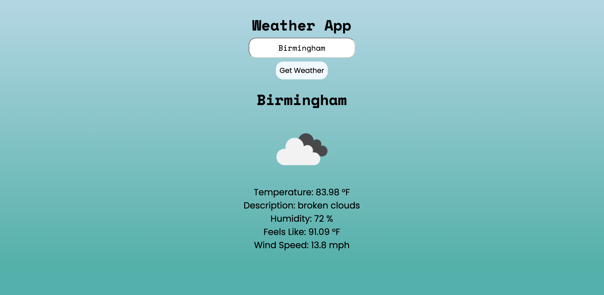
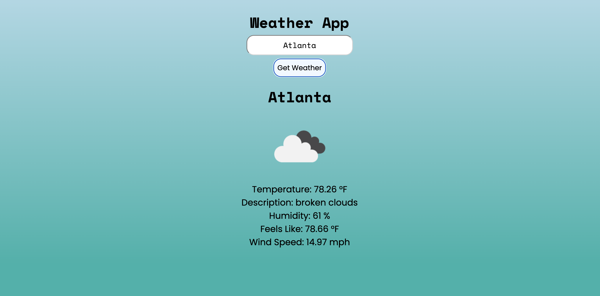

# Project Name: Weather App

**Description:**


---

**Table of Contents**

[Introduction](#introduction)
[Installation](#installation)
[Usage](#usage)
[Demonstation](#demonstration)
[Features](#features)
[Technologies Used](#technologies-used)
[Acknowledgments](#acknowledgments)
[Contact](#contact)
---

## Introduction: 
**Project: Build a Minimal APP Connecting Backend & Frontend:**
Weekly Project for Week 7 of the Techtonica Software Engineer in Training Program

**Primary Learning Goals:**
This assignment will check for proficiency in: NodeJS, ExpressJS, and how connect your backend with the frontend, as well as the following:
- Connect to 3rd party API
- Showing data from an API call
- Create dynamic API requests with user input
- Parse JSON and display data using React
- Connecting data between Express and React
- Creating Express routes
- Creating React components and filling them with dynamic data
- Using callback functions to pass data from a child to parent component
- Learn how to use and modify code from a template


**Project Requirements**
- 15+ commits
- 1+ PR
- README with a visual of the project (i.e. gif, images, deployed version) and setup instructions
- OpenWeatherMap API
- Connected frontend and backend
- Contain at minimum city name, current weather icon, temperature, humidity, and wind speed
- Display the icon images for weather conditions such as sunny, rainy, cloudy, and snowy
- Responsive design
- Showcase you can implement the primary learning goals

## Installation: 
**To create the whole project**
1.  Go to your source directory in your terminal and clone the repository by running the command:

```
$ git clone https://github.com/abbiehuynh/techtonica-projects/weather-api.git <NameNewDirectory>
```
2. `npm install` in terminal in server (techtonica-projects/weather-api) and client (/weather-api/client).

3. `npm start` on server side and `npm run dev` on client side to run weather app.

4. Visit `http://localhost:5050` for server site (ExpressJS, NodeJS) and `http://localhost:5173` for client site (React + Vite).

## Usage: 
- Input city name to choose city.
- Click button to generate city's weather data.
- Can continute to input new city names to generate a differen't city's weather information.

## Demonstration:

Once the page has loaded, you will see weather information for the city of Birmingham.


You can input the city name that you would like to check the weather for. Once you have typed the city name, you can click on the "Get Weather" button to submit the city value.


The weather data for that city input will then load on the page. 


## Features: 
- Interactive user experience through mouse click
    - input city name and click "Get Weather" to generate city's temperature, description of weather, humidity, feel's like, and wind-speed.  


## Technologies: 
- ExpressJS, NodeJS
- React + Vite  
- Postman     
- HTML, CSS
- Git
- Fetch

## Acknowledgments:
Specials thanks to Techtonica Program & Staff, my mentor, and the H2 2024 Cohort. Thank you for your continuous love and support for growth through this tech journey. 

## Contact: 
[Github](https://github.com/abbiehuynh)

[LinkedIn](https://www.linkedin.com/in/abbie-huynh/)

email: abbiehuynhh@gmail.com

[Project Link: Weather App](https://github.com/abbiehuynh/techtonica-projects/tree/weather-api)